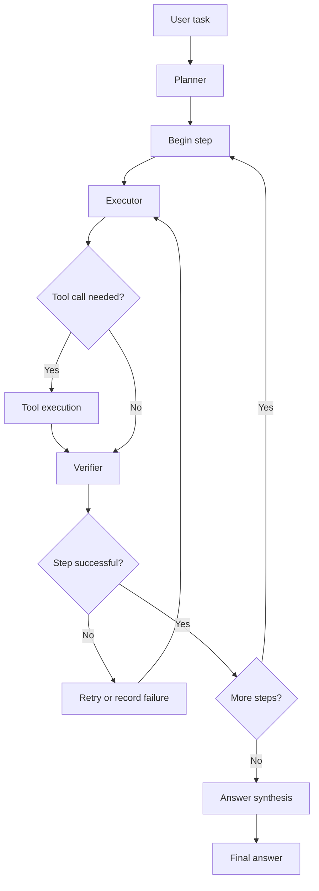

# Multi-Tool Autonomous AI Agent

A Python-based autonomous AI agent built with LangGraph and LangChain. The agent takes a natural-language task, creates a multi-step plan, selects tools, executes actions, verifies step results, retries certain failures, and synthesizes a final answer.

The project explores tool-using LLM agents, workflow orchestration, state management, error recovery, and task-based evaluation.

## Features

- **Planning and execution:** Breaks a task into steps and executes them through a graph-based workflow.
- **Tool use:** Supports Python calculations, web search, SQLite queries, date/time retrieval, and calendar operations.
- **Verification and recovery:** Checks step outcomes and can retry unsuccessful steps.
- **Stateful workflow:** Tracks the task, plan, execution progress, results, retries, and tool-call counts.
- **Final-answer synthesis:** Combines execution evidence into a final response.
- **Evaluation suite:** Includes task-specific validators, benchmark tasks, and automated tests.
- **Multiple LLM providers:** Supports local Ollama models and Google Gemini.

## Architecture



## Technology stack

- Python
- LangChain
- LangGraph
- Ollama or Google Gemini
- SQLite
- pytest
- DuckDuckGo-based web search

## Project structure

```text
ai-agent-project/
├── agent/
│   ├── config.py
│   ├── executor.py
│   ├── graph.py
│   ├── planner.py
│   ├── run.py
│   ├── state.py
│   ├── text.py
│   └── tools.py
├── data/
│   └── .gitkeep
├── evals/
│   ├── benchmark.py
│   ├── tasks.py
│   └── validators.py
├── scripts/
│   └── seed_db.py
├── tests/
│   ├── conftest.py
│   ├── test_graph.py
│   ├── test_state.py
│   └── test_tools.py
├── .env.example
├── .gitignore
└── requirements.txt
```

The structure above is illustrative; the files actually committed to the repository determine the final layout.

## Requirements

- Python 3.12 recommended for the tested environment
- Git
- One supported LLM provider:
  - Ollama with a compatible local model, or
  - A Google Gemini API key
- Internet access for web-search tasks

## Setup

### 1. Clone the repository

```bash
git clone <https://github.com/AymanAsaad27/multi-tool-autonomous-ai-agent>
cd ai-agent-project
```

Replace the placeholder URL with your repository URL after publishing.

### 2. Create and activate a virtual environment

On Windows PowerShell:

```powershell
py -3.12 -m venv .venv
.\.venv\Scripts\Activate.ps1
```

On macOS or Linux:

```bash
python3.12 -m venv .venv
source .venv/bin/activate
```

### 3. Install dependencies

```bash
python -m pip install --upgrade pip
python -m pip install -r requirements.txt
```

### 4. Configure the environment

```powershell
Copy-Item .env.example .env
```

Edit `.env` to select your provider.

For Ollama:

```env
LLM_PROVIDER=ollama
OLLAMA_MODEL=qwen2.5:7b
```

Install Ollama from its official website if needed, ensure the Ollama service is running, and download the model:

```bash
ollama pull qwen2.5:7b
```

For Gemini, configure:

```env
LLM_PROVIDER=gemini
GEMINI_MODEL=gemini-3.8-flash
GOOGLE_API_KEY=your_actual_api_key
```

Use a model identifier supported by your installed provider and account. Never commit your actual API key.

### 5. Initialize the local database

The application uses SQLite. Check the repository's database initialization instructions and run the provided seed script if the database has not already been created:

```bash
python scripts/seed_db.py
```

The database is a local runtime artifact and is intentionally excluded from Git. Review the seed script before running it repeatedly, since repeated execution may add duplicate sample records if inserts are not idempotent.

## Run the agent

From the repository root:

```bash
python -m agent.run "Calculate 25 multiplied by 4."
```

Or start the interactive prompt:

```bash
python -m agent.run
```

Example tasks:

```bash
python -m agent.run "Calculate 25 multiplied by 4."
python -m agent.run "Find the current date and calculate the number of years since 2017."
python -m agent.run "Search the web for the creator of Python."
python -m agent.run "List the notes stored in the database."
```

Web search and database tasks depend on network availability and the local database contents. Calendar tasks can modify the local database.

## Run the tests

```bash
python -m pytest -q
```

## Run the benchmark

Run all benchmark tasks:

```bash
python -m evals.benchmark
```

Run one task by ID:

```bash
python -m evals.benchmark --id python_01
```

The benchmark reports task outcomes, tool calls, retries, failures, and execution timing. Results can vary with the LLM provider, model, network, and tool responses.

## Current evaluation results

In the development environment, the project completed:

- **Automated tests:** 13 passed.
- **Benchmark tasks:** 12 of 12 passed.
- **Failed steps:** 0 in the reported full benchmark run.
- **Retries:** 0 failed-step retries overall, although some tasks used additional tool calls to recover from unsuccessful tool responses.

These are results from the current development run, not a guarantee that every task will succeed in every environment. Re-run the tests and benchmark after installation to verify your own setup.

## Limitations and security

- LLM outputs and plans are not guaranteed to be correct.
- Web-search tools may return no results, temporary errors, or incomplete information.
- Database tasks require a compatible local SQLite database and expected schema.
- Local models may be slow depending on available hardware.
- The Python execution tool must be treated as potentially dangerous if it executes model-generated code without a sandbox. Use only trusted tasks in a controlled environment; do not expose it as a public service without appropriate isolation and restrictions.
- Calendar and database operations may change local data.
- Benchmark results depend on the model and external tool availability.

## Future improvements

- Add stronger argument and output validation for tool calls.
- Improve database query planning and recovery.
- Add more benchmark tasks and edge cases.
- Record reproducible benchmark reports.
- Add sandboxing and resource limits for Python execution.
- Add structured logging and clearer failure diagnostics.

## License

A license has not yet been selected. Add a `LICENSE` file before distributing the project under an open-source license.
